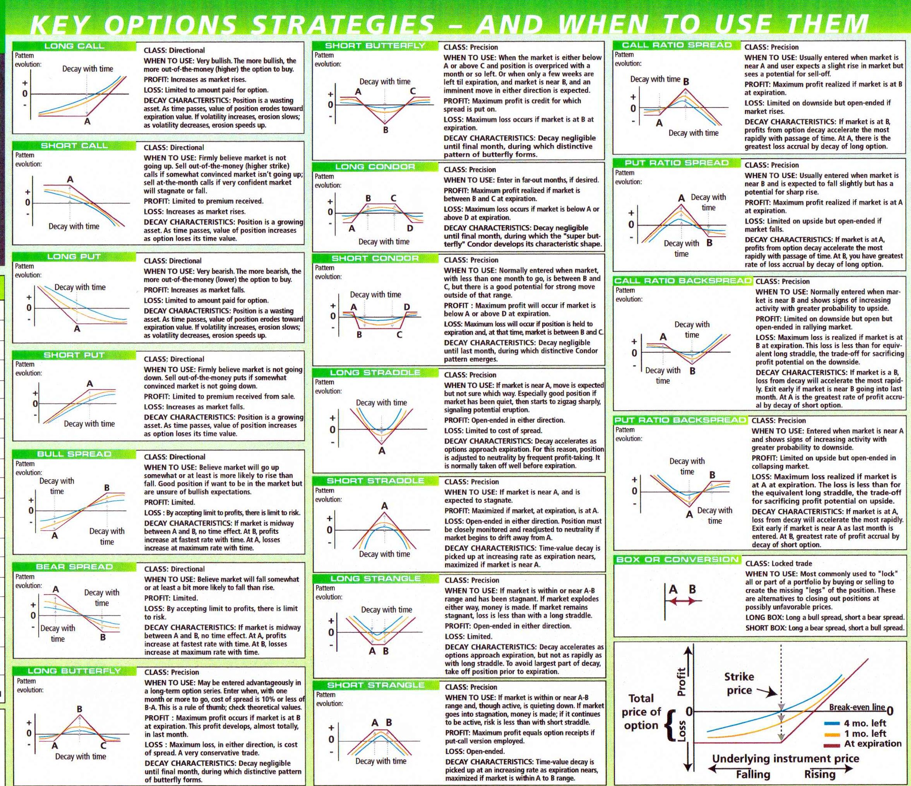
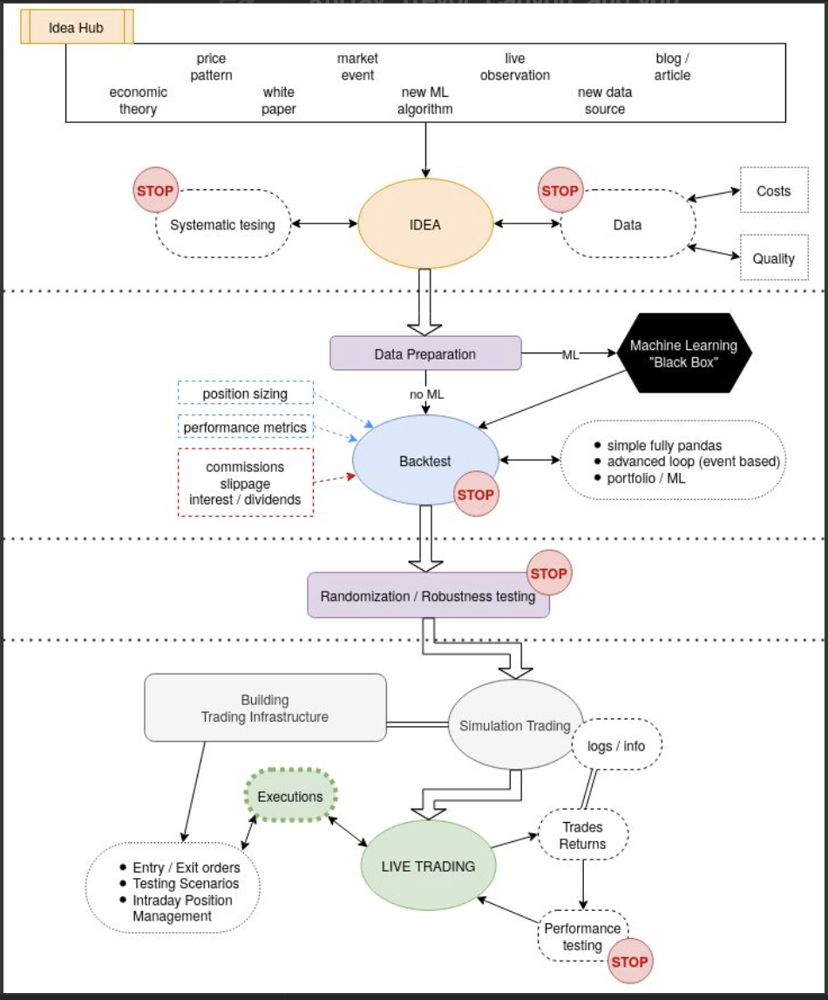
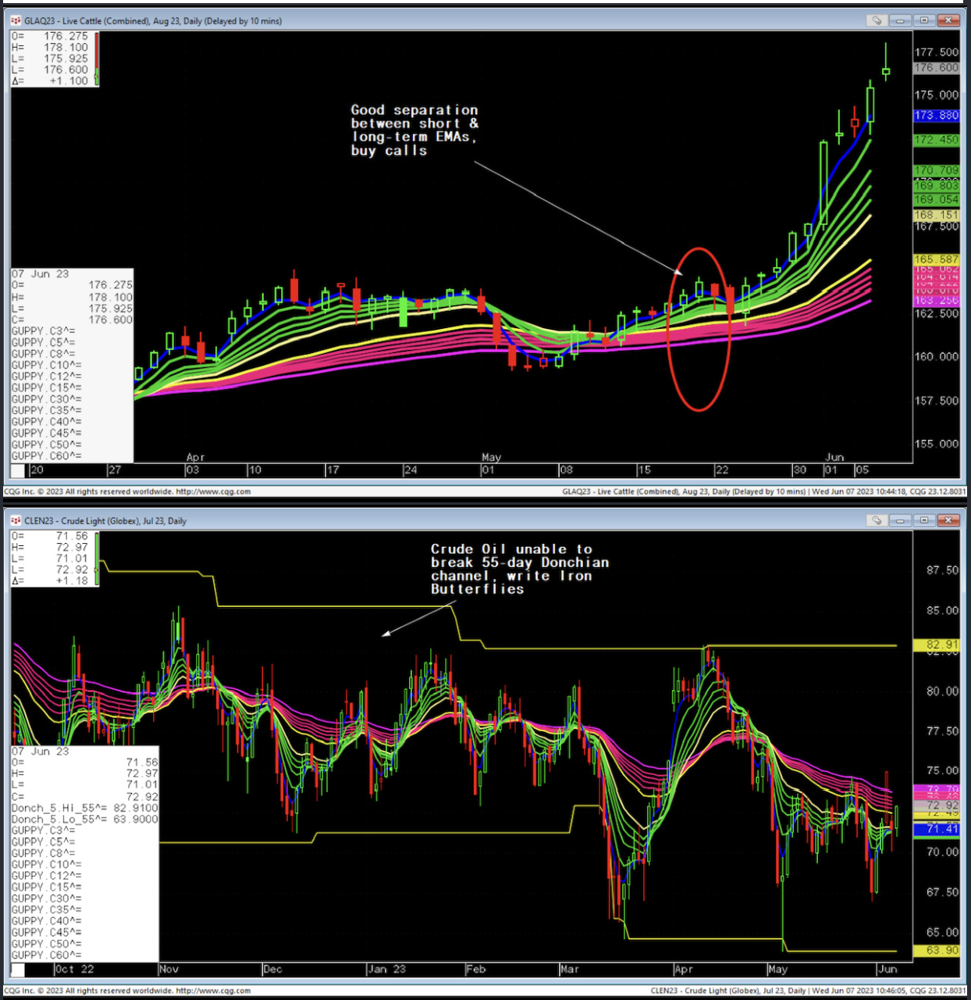

# Documents

### Table of Contents

1. [Quant Workflow](#s1)
2. [Principles](#s2)
3. [Divisions of Flexibility](#s3)
4. [Estimate Probability of Entering a Bearish Market](#s4)
5. [Bearish Strategies](#s5)
6. [Convergence/Divergence](#s6)
7. [Indicators](#s7)
8. [Donchian Channel Trading Strategies](#s8)
9. [KAMA Indicator](#s9)

---

---

## Quant Workflow 

[YouTube](https://www.youtube.com/watch?v=RomfTrm5_7g)

1. Implied Volatility

Compare implied volatility to itself (rather than to historical volatility) over different time frames to asses whether implied volatility is too high or low

2. External Volatility

Looking at the wider market and the sector to assess whether the stock is poised for higher volatility or not

3. Momentum

Looking at the price charts to see whether there are any signs of consolidation in the price pattern

4. Find Breakout

Consolidation patterns such as flags, triangles, and pennants often precede a breakout of some sort, which is what you want to happen shortly after placing a straddle trade

* Consolidations manifest visually by way of individual priceban lengths getting shorter

5. Trading straddle patterns

Ideally you trade straddles about three months out becuase time value decays at its fastest one month before expiration at the latest

Idea is to minimize risk

* With straddles, the greatest risk is time decay (THETA)

6. After Identifying consolidating stock

Determine whether there is any news anticipated on that stock

7. Placing straddle around earnings

Ideally, aim to place straddle trade a week or so before earnings, because often implied volatility starts to rise as earnings season approaches

8. Open trades

Never leave an open at the money (ATM) option position on either side with less than one month left to expiration

### Filter for straddle 

1. Optionable

2. Consolidating price pattern

3. Implied volatility lower than 90-day IV average

4. IV should not have surged and should not be higher than at the previous earnings season

* Ideally you should look a week or so before the next news event and before the pre-event IV surge

* With straddles and strangles, try to find expirations around 3 months out

5. 60-day trading rule with 3 month expiration straddles

* approximating the comparison between IV (expressing the cost of options) and historical volatility (price fluctuations over the last 3 months)

* x-month straddle ⟹ 20x-day rule

### BlackRock : Volatility is an Asset

Fact: Global credit crisis showed that correlation-the tendency of assets to behave like one another regardless of their relative merits - can oppress even the most diversified portfolio

* Include the perormance of the 60/40 portfolio during crisis periods and how long it takes to recover from losses

* When the world trades in unison-usually lower-volatility spikes and share prices sink, creating opportunities to use volatility to minimize damage and lift returns 

### VIX your portfolio : Selling Volatility to Improve Performance

* Selling volatility on a broad equity index has a positive expected return premium over time, as the seller effectively provides insurance to the buyer of volatility

* BlackRock likes selling equity volatility, not buying it, because of the persistent demand among many investors buying derivatives to hedge portfolios 

### Chris Taner's Notes on Short

Since mid-1980's, volatility cycles have averages 5.5 years and correlated with underlying economic cycles. It's logical that risk and equity volatility increase late in an economic expansion and remain elevated through a recession though before subsiding once sustained real growth is achieved

### Techinical Indicators

* Used in short-term trading to help traders determine:

1. Range of Movement (How much?)

2. Direction of move (Which way?)

3. Duration of the move (How long?)

**Best indicators for options trades**

1. RSI (Overbought/Oversold)

2. Bollinger Bands (Measuring Volatility)

3. Intraday Momentum Index

4. Money Flow Index (Volume)

5. Put-Call Ratio Indicator

6. Open Interest (declining OI indicates a weakening trend)

| Price | OI | Interpretation |
|----------|----------|----------|
| Rising | Rising | Strong |
| Rising | Falling | Weakening |
| Falling | Rising | Weak |
| Falling | Falling | Strengthening |

Others : 

* Stochastic oscillators

* Average true range

* Gann price-time cycles 

* MACD

* OLMAR

## Principles 

**Suspicious curiosity is the most important principle in investing**

1. Recognize prevalent/obvious patterns

2. Uncover hidden patterns

3. Discover non-existing/unkonwn patters

**Being right**

"We're right 50.75 % of the time, but we're 100% right that 50.75% of the time. You can make billions that way." - Robert Mercer, co-CEO of Renaissance Technologies. (Jim Simmons)

**Systematic Trading**

* Use the same code for backtesting as for live trading
---

## Divisions of Flexibility 

**Time Flexibility**

* Expiration dates

* cash

**Scope Flexibility**

* Events

**Goal Flexibility**

* Strategies

* Moneyness

**Spatial Flexibility**

* Sectors

* Position sizing

**Process Flexibility**

* Indicators

* Ensemble

---

## Estimate probability of entering a bear market 

When stocks were about to enter a bear market, what was the probability of observing conditions similar to the present?

Let X be the unobservable probability of whether or not the market will be bearish over the next 13 weeks.

Let E be the observable evidence.

We can then go back to historical data and see when X is true and observe the E (evidence). We can also note when X is not true and find the E' (counter evidence) that was observed in that case. 

After calculating X and E, Baye's Rule can be applied.

**Possible E (evidence):**

* Inverted yield curve

* Put/Call ratio on SPY or VIX

* McGinley Dynamic Indicator

⟹ Bayesian Ensemble Methods

⟹ Tree Structure

## Bearish Strategies 

* Stocks trading at excessive valuations

* Stocks with downward earnings estimate revisions

* Stocks with below 50-day or 200-day MA (moving average) or based on other technical indicators

* Stocks with sell or strong sell

## What options strategies suits different styles of stocks?

## What style/theme/story/catalyst does the stock fall into?

## Methodology to find the right options strategy for each chosen stock?

## Methodology to build portfolio of options?

* Greeks

* Diversification

* Modulation

## Convergence/Divergence 

[YouTube](https://www.youtube.com/watch?v=6vcxsJVBqIo)

## Indicators 

* Simple MA(50, 0)

* Simple MA(100, 0)

* Simple MA(200, 0)

* RSI(7)

* Asymmetrical Volatility Band

* Connors RSI(3, 2)

* DMI(14)

* Chaikin Oscillator

* TMV(HLC Avg, 20, 1)

* Hurst(25)

* ROC(1)

* Hindenburg

## Donchian Channel Trading Strategies 

(Richard Weissman)

* Need to determine the environment first
    - (1.) **Trending** - buying slightly OTM calls/puts
    - (2.) **Mean reverting** - write iron butterflies or iron condors

* To determine underlying environment use simple indicators:
    - EMA's (or series of EMA's like Guppy EMA's)
    - When we have good clustering we are mean reverting
    - When we have good separation, we are trending

* Donchian channels are also good for making the distinction between clustering and separation. As well as the trend of implied volatility

* The Donchian channel indicator plots an upper band (n-bar high), a lower band (n-bar low), and a middle band that's the average of the two. 

* Preferred and best donchian channel setting is n = 20 (# periods)
    - Many regard a breakout above the upper band or below the lower band as a signal worth acting on

* Upper band : highest high for the last n-periods

* Lower band : lowest low for the last n-periods

* Middle band : (Upper + Lower) / 2

### Determining Volatility with the Distance between the Bands

* When the distance between bands gets smaller, it's generally believed that the chances of breakout to either side get bigger

* Wider gap in bands implies more volatility

### Trend Following

* Define breakout above upper band as positive signal (long)

* Define breakout below lower band as negative signal (short)

**When to Exit**

* Trailing Stops
    - For breakout above upper band, set trailing stop when price goes below moving average

* Time Exit
    - Find average duration of a trend in market and use that time to set when to exit

* Stop Loss & Profit Target
    - Ensure to have risk-reward ratio > 1
    - Ensures potential profit is greater than potential loss
    - ie: Profit target is $200 away from entry and stop loss is $100 away from entry, risk-reward ratio = 2

Trend following works in markets that tend to trend a lot, like commodity markets. However, in other markets like stocks and equities, we might want to use mean reversion.

### Mean Reversion

* The tendency to revert as recent history has made exaggerated moves in one direction

* Market moved too much to the downside -> Oversold

* Market moved too much to the upside -> Overbought

* Opposite rules to Trend Following
    - Breakout above upper band -> Short signal
    - Breakout below lower band -> Long signal
    - Exit when the market crosses the middle band

**When to Exit**

* Stop Loss

* Specify some condition that defines that the market isn't oversold anymore (close is above middle band) 
    - Cross moving average
    - Cross RSI

* Favorite:
    - Wait until short term RSI crosses above a high threshold

When taking mean reversion trades with Donchian channels, it's alwasy a good idea to watch the overall direction of the trend

* A market in a falling trend will be more prone to continue making new lows as opposed to a marked with a rising trend
    - 20 period low in a bullish market will be more likely to lead to reversal than one that forms in a negative trend
    - This is why it is recommended to use 200-period moving average as regime filter

* Use 200-period MA to identify the long-term market trend
    - Only take mean reversion trades if the market trades above its moving average

### Best Settings

* n = 20 (# periods)

**Original Donchian Channels & MACD**

* Use both to signal up or down trend

* Long trades on positive MACD crossovers appearing close to the lower band
    - Exit once we have negative MACD crossover

**When to Enter**

* Market is breaking out below the lower band or has recently performed a breakout

* We have a positive MACD crossover, signaling that a trend reversal is likely

**When to Exit**

* Negative MACD crossover

* Market goes up and breaks upper Donchian Channel band

### Doji Candlestick Pattern

* Mean Reversion

* Candle where the market closes and opens at roughly the same price

**When to Enter**

* Breakout below the low that forms as a Doji, or is followed by a Doji

**When to Exit**

* When market hits upper band

### ADX

* Trend Following

* Breakout above the high of the upper band -> Long 

* Breakout below the lower band -> Short

* Entries like these are very likely to cause a lot of false breakouts
    - To mitigate this, we use a filter (ADX Indicator)

* ADX tells us when there is enough momentum for a breakout to succeed

* ADX > 30 -> Long

**Rules**

* Breakout above upper band

* ADX > 30

* Exit using a trailing stop 

### Other Channels

**Keltner Channel**

* 3 lines

* Middle band : Exponential Moving Average

* Upper and lower bands are placed at distance equivalent to the average true range times 2 (above and below, respectively) the middle band

**Bollinger Bands**

* 3 lines

* Middle band : Exponential moving average

* Upper and lower bands are placed equivalent 2 times the standard deviation of closing prices
    - Show dispersion from the mean rather than actual market ranges

## KAMA Indicator 

* Kaufman Adaptive Moving Average

1. Calculate direction of market for chosen time period (n-days)

ABS(close_0 - close_n)

2. Calculate volatility

∑_1^n ABS(close_t - close_t-1)

Efficiency ratio fluctuates between 0 and 1

* 1 implies the price would rise for n consecutive periods or fall n consecutive period

* 0 implies the price could not move for n consecutive periods

> Note for an n-lengthed period, we take the summation of (n - 1) differences

3. Calculate Efficiency Ratio

Efficiency Ratio = Direction / Volatility

4. Calculate Smoothing Constant

* Uses Efficiency ratio and two alphas
    - AlphaFast = Fast exponential moving average (2-day MA)
    - AlphaSlow = Slow exponential moving average (30-day MA)

* AlphaFast is used in KAMA calculation when the market is quiet

* AlphaSlow is used in KAMA calculation when teh market is volatile

Smoothing Constant = (Efficiency Ratio * (AlphaFast - AlphaSlow) + AlphaSlow)^2

5. Calculate KAMA

KAMA_0 = KAMA_-1 + Smoothing Constant * (Price_0 - KAMA_-1)

### Practical Use

* Trend Following Indicator

* KAMA follows the price so you can use it to identify the dominant trend on the market. 
    - Set alphas to 50 and 200-day MA
    - This makes KAMA more robust and show just main market moves

* Efficiency Ratio (between 0 and 1)shows us how big the price change was within the selected number of days
    - 1 : Strong trend
    - 0 : No trend 

**Another way to trade with KAMA**

* close price > KAMA -> Long

* close price < KAMA -> Short

**Another way to trade with KAMA**

* Set high and low alphas to create two different KAMA's 

* Faster KAMA > Slower KAMA -> Long

* Faster KAMA < Slower KAMA -> Short
  
KAMA can be used in Bollinger Bands intead of simple moving average 

KAMA can be used in MACD instead of Exponential moving average
