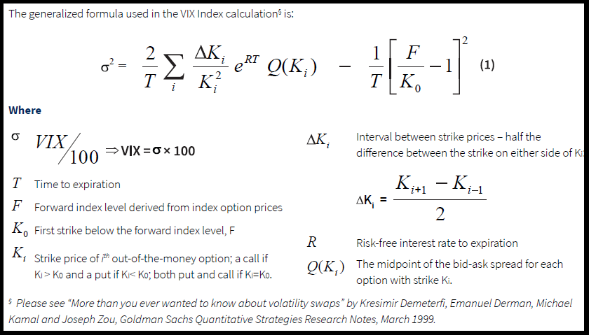

# VIX Calculator

* VIX is the fear gauge of S&P 500 index

* Using Riemann sum and Taylor series expansion, we convert a continuous fair price variance sqap to a discrete options volatility index (VIX).

* Determined by two components
    - 3-week-ahead weekly S&P 500 options
    - one-month-ahead monthly S&P 500 options

* Great risk management tool

